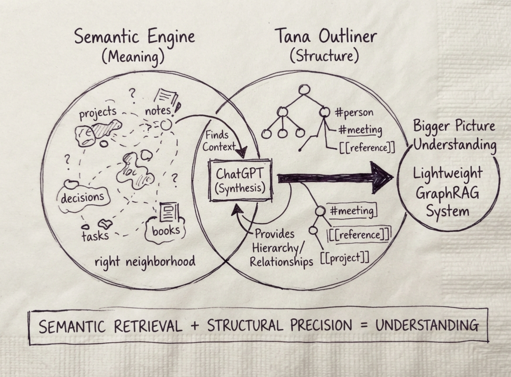
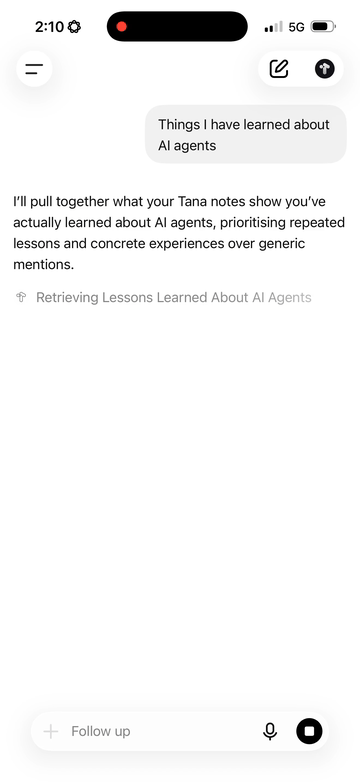
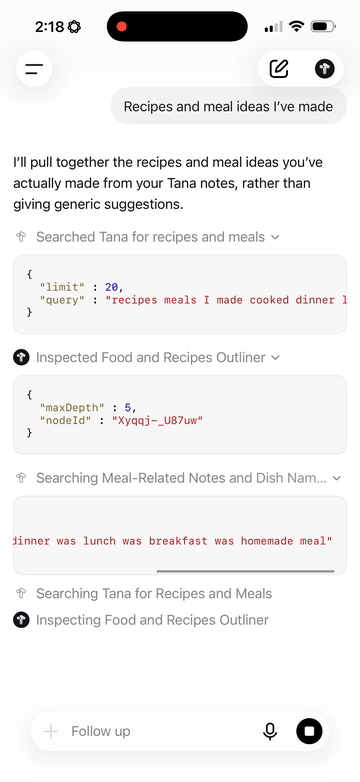

# Tana Semantic Engine

> A layer of intelligence that sits above your Tana workspace. It helps your AI understand your work more like you do: not just as isolated notes, but as ideas, objects, and relationships that form a bigger picture.

---

## How It Works

- **Search by Meaning, Not Just Keywords:** When you ask about something in your workspace, the Semantic Engine uses vector embeddings to search by meaning rather than relying only on exact keywords or manually constructed search queries. Notes, projects, tasks, people, decisions, books, movies, and anything else you've captured become part of that semantic memory.
- **Semantic Retrieval Meets Structural Precision:** But semantic search is only one half of the picture. Connect ChatGPT (or any AI client) to both the **Tana Semantic Engine** and the **Tana Outliner**, and semantic retrieval works alongside Tana’s native graph. The Semantic Engine finds potentially relevant information by meaning, while Tana Outliner provides the structure around it: supertags, fields, references, hierarchy, and relationships.
- **Lightweight GraphRAG for Tana:** Together, they form a lightweight GraphRAG system for Tana. Semantic search finds the right neighbourhood of information. Graph traversal establishes what those things are and how they connect. ChatGPT brings both together to understand the bigger picture.
- **No Friction or Forced Categorisation:** The goal isn’t to meticulously categorise every thought you’ve ever written. Your existing notes remain useful as semantic memory, while Tana’s structured objects add precision where structure actually earns its keep.
- **Natural Interaction:** No complex search nodes. No need to remember exactly where something lives or how you worded it. Ask naturally, and let the system find the context.

<p align="center">
  
</p>

### The Dual Role: Semantic Map & Inference Ranking Engine

The finished product is not just a deployable semantic embedding mirror of your workspace—it is an **active inference search engine** designed to ground LLM reasoning:

1. **Multi-Facet Candidate Discovery:** Instead of relying on a single query paraphrase, the engine retrieves candidate seeds across orthogonal facets (actions, causes, outcomes, people, events, likely titles, and decisions), blending dense vector search (`bge-small-en-v1.5`) with lexical BM25 (`fts5`).
2. **Structural Subgraph Expansion:** Candidates are treated as seeds, expanding up to parents, down to child checklists, and across bidirectional references (`[[reference]]`) and supertag schemas (`#person`, `#meeting`, `#project`).
3. **Multi-Factor Reranking & Evidence Hierarchy:**
   - **Relevance:** Dense semantic similarity combined with exact title and field lexical matching.
   - **Authority & Centrality:** Cluster density and structural importance of core supertags.
   - **Temporal Provenance Routing:** Calendar ancestry (`Daily notes → Year → Week → Day → note`) serves as primary chronological truth over isolated date fields.
   - **Evidence Strength:** Ranks evidence hierarchically:
     $$\text{direct contemporaneous} > \text{later direct recollection} > \text{structured synthesis} > \text{AI-generated interpretation}$$
     $$\text{direct evidence} > \text{repeated evidence} > \text{contextual inference} > \text{stated intention} > \text{speculation} > \text{generic mention}$$
   - **Live Source Freshness:** Excludes deleted/inTrash items and verifies canonical day nodes before asserting negative claims (*never infer "nothing due" from an empty search*).

---

## See It in Action (Mobile GraphRAG in Real Use)

Watch how Tana Context Mask powers grounded reasoning and native deep-linking on mobile:

<table>
  <tr>
    <td width="50%" align="center" valign="top">
      <h4>Case 1: Complex Synthesis & Native Mobile Deep-Linking</h4>
      <a href="assets/demo_agent_learning_synthesis.mp4">
        
      </a>
      <p align="center"><a href="assets/demo_agent_learning_synthesis.mp4">▶ <strong>Watch Full Video (1m 06s)</strong></a></p>
      <p align="left">
        <strong>Prompt:</strong> <em>"Things I have learned about AI agents"</em><br>
        <strong>GraphRAG Behaviour:</strong> The engine retrieves candidate lessons across projects (e.g. <em>Building a Drift Detector</em>), separates retrieval from reasoning, and formats clean citations. Tapping a citation in ChatGPT deep-links directly into the native <strong>Tana iOS App</strong> to the exact note.
      </p>
    </td>
    <td width="50%" align="center" valign="top">
      <h4>Case 2: Evidence Separation & Deep Outliner Traversal</h4>
      <a href="assets/demo_recipes_evidence_separation.mp4">
        
      </a>
      <p align="center"><a href="assets/demo_recipes_evidence_separation.mp4">▶ <strong>Watch Full Video (1m 12s)</strong></a></p>
      <p align="left">
        <strong>Prompt:</strong> <em>"Meals & Recipes Cooked vs Planned"</em><br>
        <strong>GraphRAG Behaviour:</strong> Executes multi-step outliner inspections (depth 3–5). It separates <em>confirmed cooked/eaten meals</em> from <em>unconfirmed saved ideas</em>, identifies qualitative feeling ("made you feel good" vs "too heavy"), and highlights the strongest candidate.
      </p>
    </td>
  </tr>
</table>

---

## Supported AI Interfaces

Built to interface cleanly with major AI ecosystems:

| Standard | Compatible Clients | Integration Method |
| :--- | :--- | :--- |
| **OpenAPI 3.0.1 Actions** | ChatGPT (Web, macOS, iOS, Android), LibreChat, OpenWebUI | Import `/openapi.json` |
| **Model Context Protocol (MCP)** | Claude Desktop, Cursor, Windsurf, Cline, Antigravity | Connect to `/sse?apiKey=<KEY>` |
| **REST API** | LangChain, LlamaIndex, AutoGen, Custom Agents | Standard `POST /api/v1/context/acquire` |

---

## Architecture: Edge Cloud vs Self-Hosted

Choose the deployment model that best matches your workflow:

```
                      ┌──────────────────────────────────────────────┐
                      │    AI Clients (ChatGPT / Claude / Agents)    │
                      └──────────────────────┬───────────────────────┘
                                             │ HTTPS / OpenAPI / MCP SSE
                                             ▼
┌────────────────────────────────────────────────────────────────────────────────────────┐
│                        Tana Context Mask Gateway                                       │
│                                                                                        │
│   Option A: 100% Serverless Edge (Cloudflare)   Option B: Universal Container (Docker) │
│   ───────────────────────────────────────────   ────────────────────────────────────── │
│   • Edge GPUs: Workers AI (BGE-Small 384-dim)   • Local/VPS GPU/CPU: FastEmbed         │
│   • Vector DB: Cloudflare Vectorize             • Vector DB: LanceDB                   │
│   • Metadata: Cloudflare D1 (SQLite FTS5)       • Metadata: SQLite FTS5                │
│   • Continuous Cloud Cron Sync (Every 15 min)   • Background Sync Daemon               │
│   • Zero local computer dependencies (24/7)     • Self-hosted on AWS, GCP, Fly.io, etc.│
└────────────────────────────────────┬───────────────────────────────────────────────────┘
                                     │ Remote MCP Sync
                                     ▼
                     ┌───────────────────────────────┐
                     │     Tana Knowledge Graph      │
                     └───────────────────────────────┘
```

---

## Quickstart

> For a complete, step-by-step walkthrough covering prerequisites, accounts, and AI client configuration, see the [Beginner's Setup Guide](USER_GUIDE.md).

### Option 1: Automated Serverless Edge (Recommended)

Deploy to Cloudflare's global edge network in under 5 minutes. Operates 24/7 online with zero local machine compute required:

```bash
git clone https://github.com/krshirkoohi/tana-context-mask.git
cd tana-context-mask

# Run automated deployment
./deploy.sh
```

**What `./deploy.sh` provisions:**
1. Authenticates your Cloudflare CLI (`wrangler`).
2. Creates your serverless Cloudflare D1 SQLite Database (`tana-db`) and applies `schema.sql`.
3. Provisions your Vectorize Index (`tana-nodes-index`) with 384 dimensions matching `@cf/baai/bge-small-en-v1.5`.
4. Securely stores your encrypted `TANA_API_TOKEN` secret.
5. Deploys the worker to Cloudflare's edge network and outputs your live production URL:
   `https://tana-context-mask.<your-subdomain>.workers.dev`

---

### Option 2: Self-Hosted Container (Docker / Cloud Run / AWS)

For self-hosting on standard container infrastructure:

```bash
# Install as a local Python package
pip install -e .

# Run the API server
python3 -m tana_context_mask.cli serve --port 8000
```

Deployable to Google Cloud Run, AWS ECS, Fly.io, or standard Kubernetes clusters.

---

## Connecting to AI Clients

### 1. ChatGPT (Custom GPT Action)
1. Open ChatGPT → **Explore GPTs** → **Create a GPT** → **Configure**.
2. Under **Actions**, click **Create new action**.
3. Click **Import from URL** and enter:
   ```text
   https://<your-worker-subdomain>.workers.dev/openapi.json
   ```
4. Set **Authentication** to **API Key**, choose **Bearer**, and paste your private `API_KEY` secret.
5. In **Instructions**, add:
   ```text
   Always invoke the acquireContext action before answering questions regarding projects, notes, meetings, or background context to ground answers with direct Tana links.
   ```

### 2. Claude Desktop / Cursor / Cline (Remote MCP)
Add the server endpoint to your MCP configuration:
```json
{
  "mcpServers": {
    "tana-context": {
      "command": "npx",
      "args": [
        "-y",
        "mcp-remote",
        "https://<your-worker-subdomain>.workers.dev/sse"
      ]
    }
  }
}
```

---

## Security & Authentication Guide

The Tana Semantic Engine is hardened with a mandatory zero-trust security model to ensure private workspace data is never publicly exposed. All private endpoints (`/api/*`, `/sse`, `/mcp`, `/messages`, `/mc`) reject unauthenticated requests with `401 Unauthorized`.

### 1. Generating & Provisioning Your API Key
When deploying via `./deploy.sh`, a cryptographically secure 16-byte hex key is automatically generated and stored directly into Cloudflare's encrypted secrets store.

To generate and provision your key manually:
```bash
# Generate a 32-character secure random key
openssl rand -hex 16

# Store securely in Cloudflare (never written to disk or git)
cd worker
npx wrangler secret put API_KEY
```

> [!IMPORTANT]
> **Zero-Leakage Policy:** NEVER commit or hardcode your API key to any file in your Git repository. The engine is architected to read credentials exclusively from Cloudflare Worker runtime secrets (`c.env.API_KEY`). Always keep your `.env` or local files in `.gitignore`.

---

### 2. Connecting Your AI Clients

#### A. ChatGPT Custom GPT Actions
1. In ChatGPT, open your GPT editor (**Explore GPTs → Create / Edit → Configure**).
2. Under **Actions**, click **Create new action**.
3. Under **Schema**, click **Import from URL** and paste:
   ```text
   https://<your-subdomain>.workers.dev/openapi.json
   ```
4. Configure **Authentication**:
   * **Authentication Type:** Select **API Key**.
   * **Auth Type:** Select **Bearer**.
   * **API Key:** Paste your generated secret API key.
5. In **Privacy Policy**, enter your worker root URL (`https://<your-subdomain>.workers.dev`).
6. Click **Save**.

#### B. Claude Desktop, Cursor & MCP Clients
Configure your client’s MCP settings file (e.g. `claude_desktop_config.json`):
```json
{
  "mcpServers": {
    "tana-context": {
      "command": "npx",
      "args": [
        "-y",
        "mcp-remote",
        "https://<your-subdomain>.workers.dev/sse?apiKey=<YOUR_SECRET_API_KEY>"
      ]
    }
  }
}
```
*Alternatively, if your client supports custom HTTP headers, pass `Authorization: Bearer <YOUR_SECRET_API_KEY>` or `x-api-key: <YOUR_SECRET_API_KEY>`.*

---

## Prerequisites & Free-Tier Reality Check
- **Tana Plus Account (or Pro):** You only need **Tana Plus** to access Tana's remote API and cloud-hosted MCP endpoint (`https://app.tana.inc/mcp`). Tana's free Core tier does not support API token generation.
- **Hosting Account:** A free Cloudflare account ($0/mo) covers 24/7 serverless edge compute, Vectorize vector search, and D1 SQLite storage (supports up to 10,000 nodes and ~13,000 queries/month on the free tier).
- **AI Client:** Creating Custom GPT Actions requires ChatGPT Plus/Team ($20/mo). Free-tier users who do not have ChatGPT Plus can connect the engine directly to **Claude Desktop** (which supports MCP 100% free with no subscription) or open-source clients like **Cursor**, **LibreChat**, or **OpenWebUI**.

---

## Extensibility: Source-Agnostic Property-Weighted Retrieval

The retrieval engine (dense/sparse hybrid search + multi-hop ancestry + schema density + key-value property weighting) is fundamentally source-agnostic:

- **Universal Entity & Property Schema:** Any structured outliner or knowledge graph (hierarchical nodes, tags, fields, references) maps directly into our graph schema `(id, name, parent_id, fields, edges)`.
- **Configurable Property Weights:** JSON key-value properties can be weighted dynamically so high-signal attributes (`Status`, `Tags`, `Priority`, `Assignees`, `Dates`) automatically drive reranking priority.
- **MCP Portability:** By attaching standard Model Context Protocol (MCP) ingestion adapters, the engine can index and retrieve across any MCP-compliant tool without altering the core Cloudflare Edge Graph-RAG pipeline.


